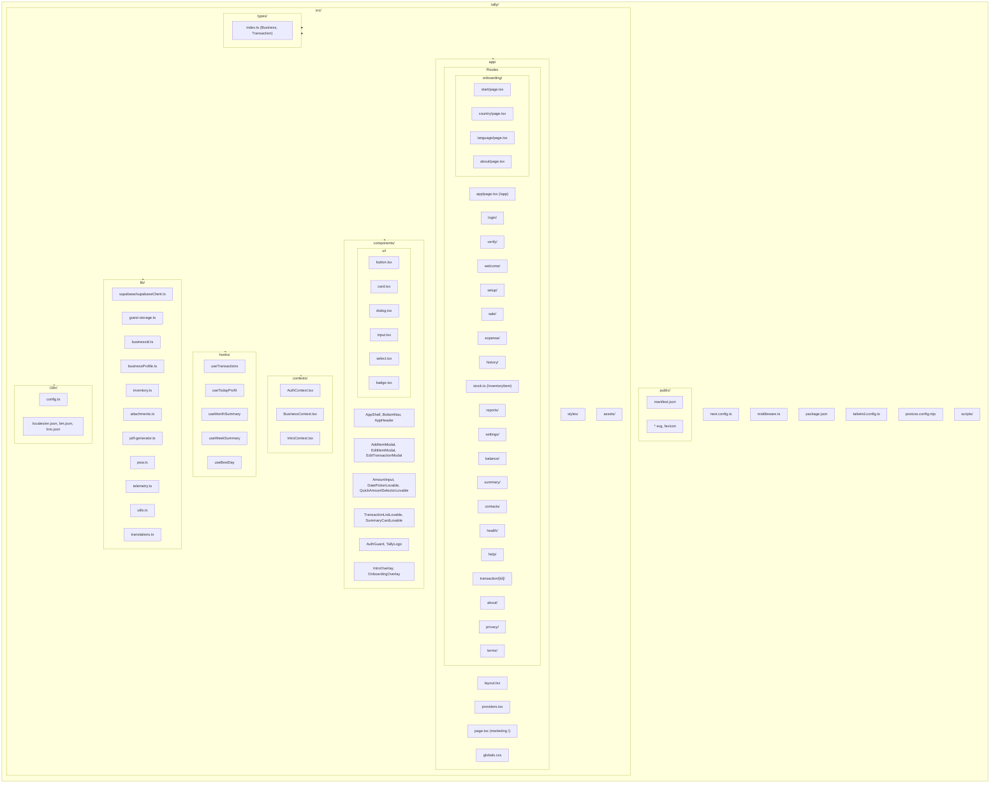
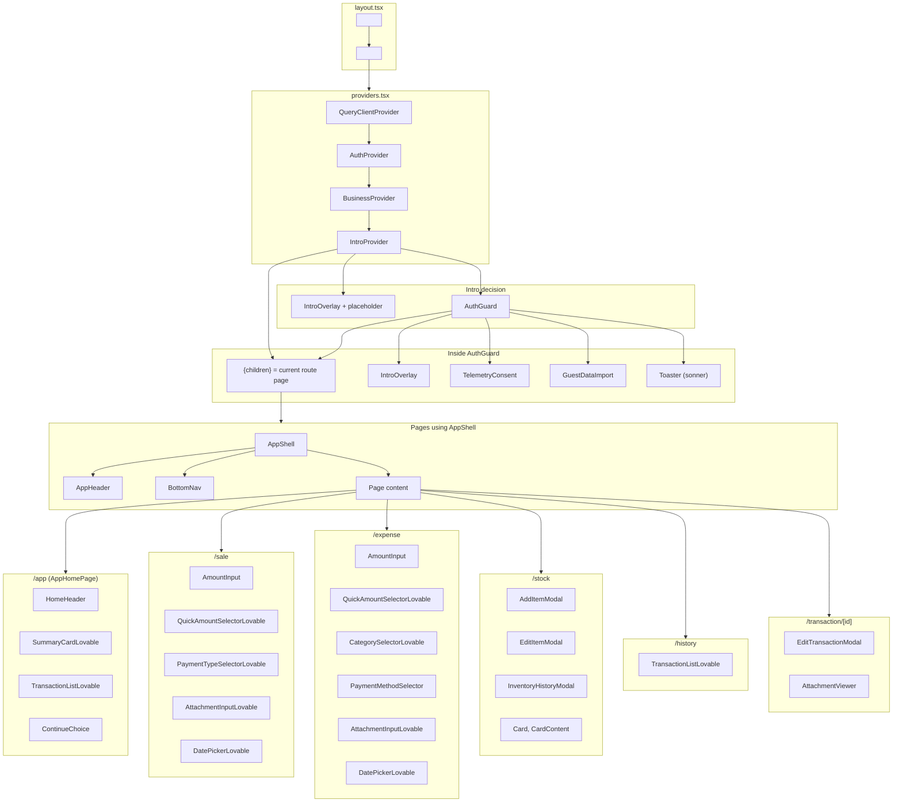
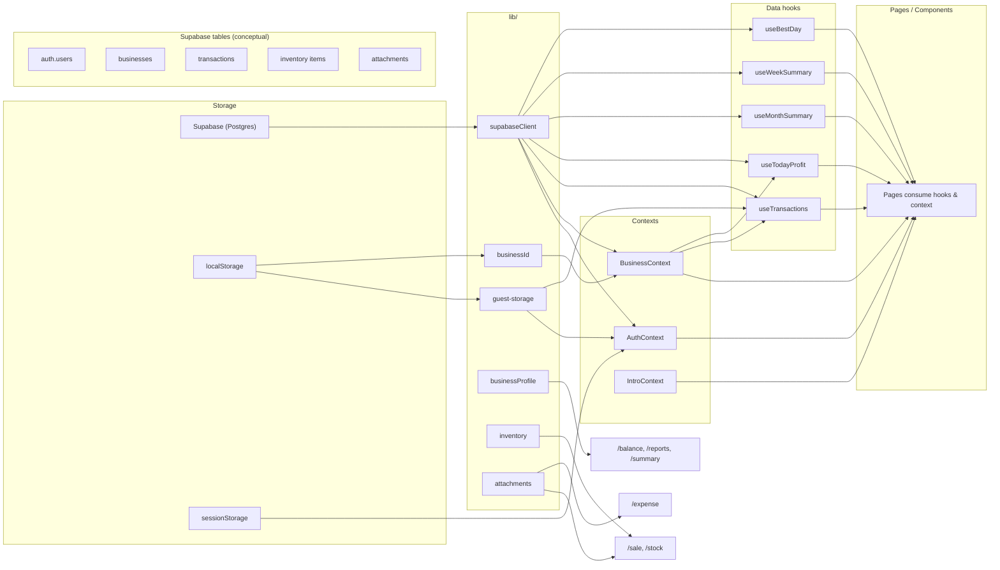
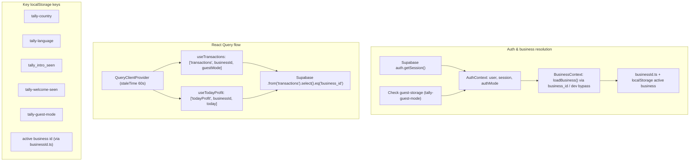
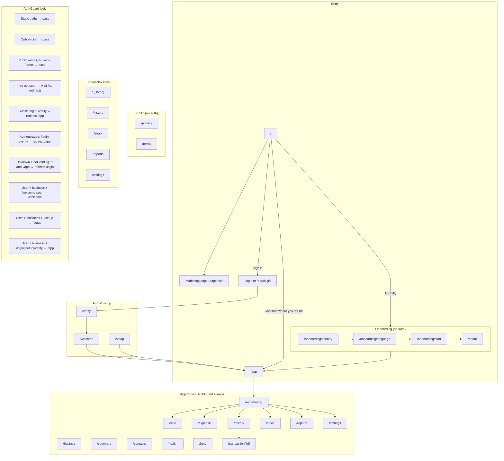
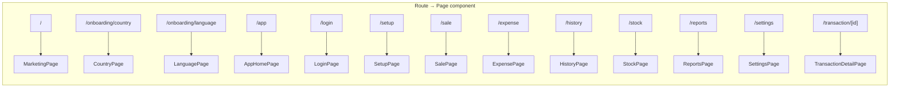

# Tally — Website Architecture

This document outlines the Tally project's architecture for export to other AI builders. It includes file structure, component hierarchy, data flow, routing, and tech stack.

---

## Tech Stack (from package.json)

| Category | Technology |
|----------|------------|
| **Framework** | Next.js 16.1.3 (App Router) |
| **UI** | React 19.2.3, React DOM 19.2.3 |
| **Styling** | Tailwind CSS 3.4.17, clsx 2.1.1, tailwind-merge 2.5.5 |
| **Backend / Auth** | Supabase (@supabase/supabase-js 2.39.0, @supabase/ssr 0.5.2) |
| **Data & State** | TanStack React Query 5.0.0 |
| **Forms** | React Hook Form 7.0.0, @hookform/resolvers 3.0.0, Zod 3.0.0 |
| **i18n** | i18next 23.7.0, react-i18next 13.5.0 |
| **Charts / PDF** | Recharts 2.10.0, jspdf 2.0.0 |
| **Icons** | Lucide React 0.468.0 |
| **Notifications** | Sonner 1.0.0 |
| **Dates** | date-fns 3.0.0 |
| **PWA** | next-pwa 5.6.0 |
| **Dev / Build** | TypeScript 5, ESLint 9, PostCSS 10.4.20, Autoprefixer 10.4.20 |

---

## 1. File Structure (Mermaid)

---

## 2. Component Hierarchy (Mermaid)

---

## 3. Data Flow (Mermaid)

---

## 4. Routing & Navigation (Mermaid)

---

## 5. Middleware

- **File:** `middleware.ts` at project root.
- **Matcher:** All paths except `_next`, `favicon.ico`, `icons`, `brand`, `manifest.json`, and static file extensions.
- **Behavior:** For matched routes, calls `NextResponse.next()` (no redirects). Static paths are explicitly passed through.

---

## 6. Provider Nesting Order

From outer to inner:

1. `QueryClientProvider`
2. `AuthProvider`
3. `BusinessProvider`
4. `IntroProvider`
5. `AuthGuard` (when intro decision is made)
   - `children` (route content)
   - `IntroOverlay`
   - `TelemetryConsent`
   - `GuestDataImport`
   - `Toaster`

---

## 7. Key Paths Summary

| Path | Purpose |
|------|--------|
| `/` | Marketing / landing |
| `/onboarding/country` | Choose country |
| `/onboarding/language` | Choose language |
| `/onboarding/start`, `/onboarding/about` | Onboarding steps |
| `/app` | App home (after intro/onboarding) |
| `/login` | Sign in (or guest entry) |
| `/verify` | OTP / verification |
| `/welcome` | First-time welcome (authenticated + business) |
| `/setup` | Create/select business (authenticated, no business) |
| `/sale`, `/expense` | Record sale / expense |
| `/history` | Transaction list |
| `/transaction/[id]` | Transaction detail + edit |
| `/stock` | Inventory |
| `/reports`, `/summary`, `/balance`, `/health` | Reports & balance |
| `/contacts` | Contacts |
| `/settings` | Account & app settings |
| `/help` | Help |
| `/about`, `/privacy`, `/terms` | Legal / info (public) |

---

*Generated for export to other AI builders. Reflects the codebase as of the audit date.*
