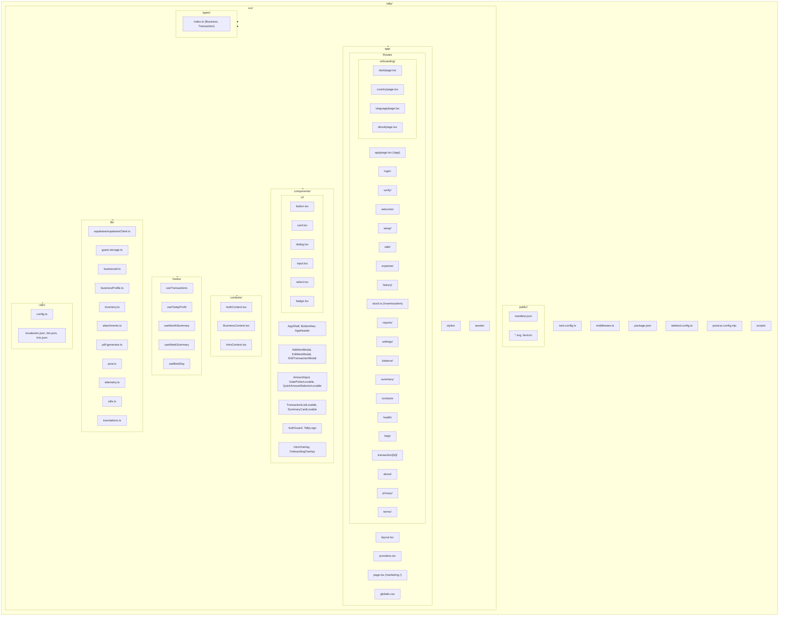
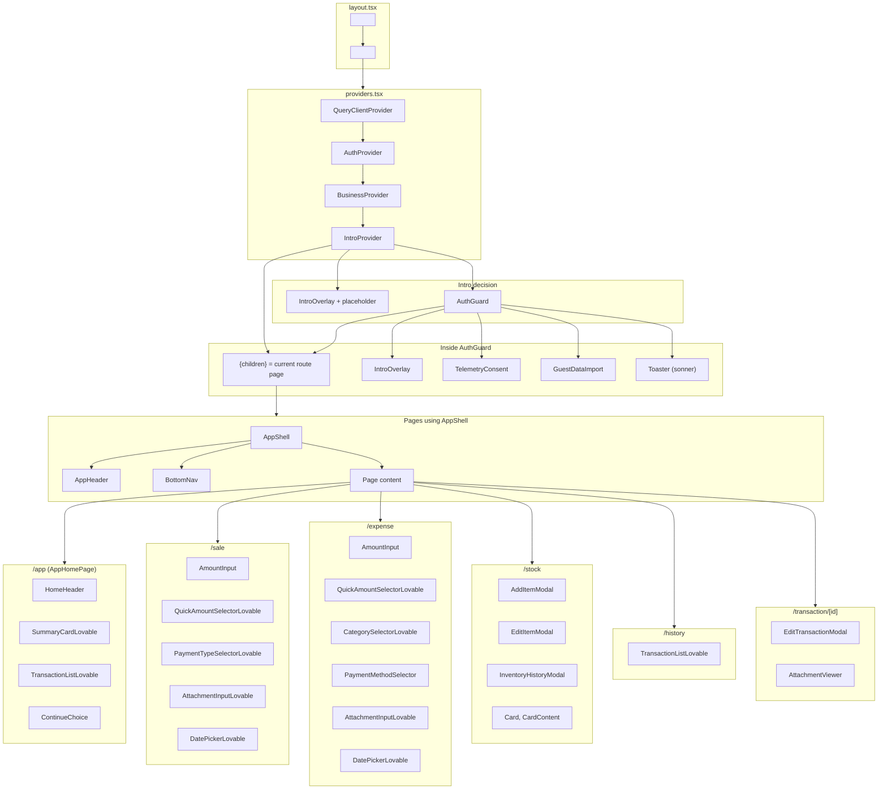
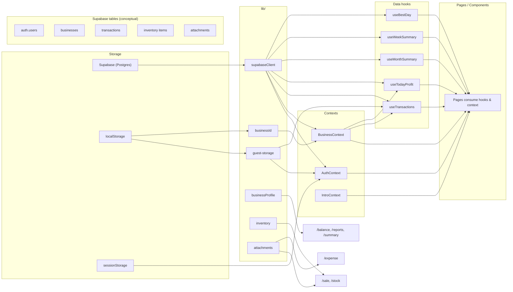
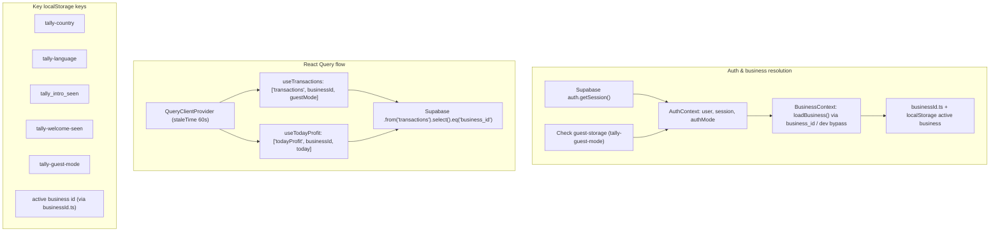
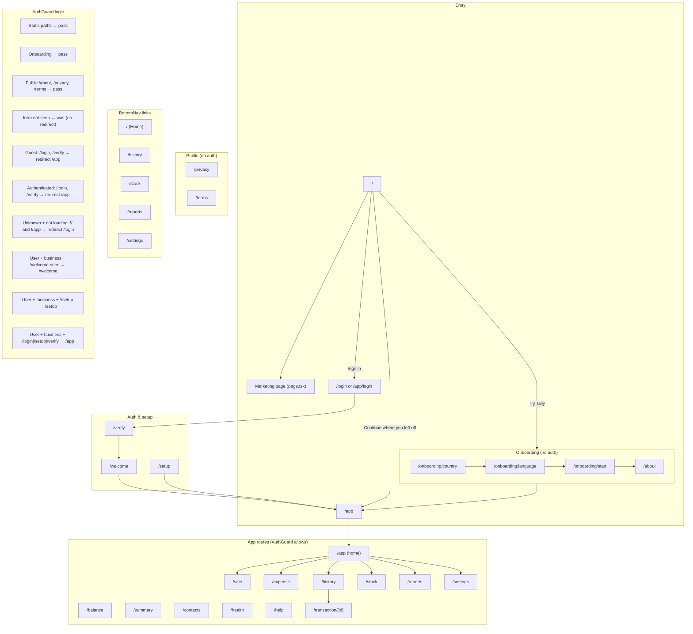
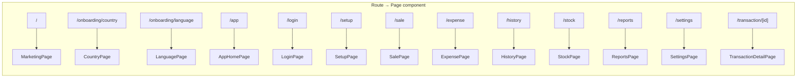

# TALLY — Build Blueprint

Use this document as the full prompt to rebuild this exact website from scratch in another AI tool. It contains a textual summary of the project, the complete tech stack, the database schema, and all architecture diagrams (Mermaid).

---

## 1. PROJECT SUMMARY (TEXTUAL)

**Tally** is a digital ledger web app for small businesses: shops, stalls, and service providers. It is built for daily, casual use—not for accountants. The product helps users record what comes in (sales, payments received) and what goes out (expenses, payments made), and see today’s balance and history.

**Audience:** Small business owners who may not keep formal records, who write in notebooks or rely on memory, or who do not track at all. The app is marketed as “a quiet daily ledger” with “no setup, no complicated screens, no pressure to be perfect.”

**Core flows:**
- **Landing:** A marketing page at `/` explains the value (“When money moves every day… What came in, what went out, and what is left”). CTAs: “Try Tally” (onboarding), “Sign in,” and “Continue where you left off” (when the user has prior usage).
- **Onboarding (no auth):** User picks country → language → optional start/about steps, then enters the app. Country and language are stored in `localStorage` (`tally-country`, `tally-language`).
- **Intro:** After language is set, a one-time intro overlay explains the product. Closing it sets `tally_intro_seen` and sends the user to `/app`.
- **Auth:** Users can use the app as **guests** (data in `localStorage` via `tally-guest-mode`) or **sign in** with Supabase Auth (email/OTP). Guest mode blocks `/login` and `/verify`; authenticated users are redirected from those routes to `/app`.
- **Business:** Authenticated users must have a **business**. If they have none, they are sent to `/setup` to create one. If they have one but have not seen the welcome screen, they are sent to `/welcome` once. The active business id is stored via `lib/businessId.ts` (e.g. in `localStorage`).
- **App home (`/app`):** Shows today’s cash in, cash out, and balance (from `useTodayProfit`); primary actions “Record sale” and “Record expense”; and a short “Recent activity” list (from `useTransactions`). Uses `AppShell` (header + main + bottom nav).
- **Recording:**  
  - **Sale (`/sale`):** Amount, payment type (cash, bank transfer, e-wallets, etc.), optional date, optional attachment, optional inventory deduction. Supports guest (save to `guest-storage`) or Supabase `transactions` insert + optional inventory deduction and attachments.  
  - **Expense (`/expense`):** Amount, category, payment method, optional date/attachment. Same guest vs Supabase split.
- **History:** `/history` lists transactions (from `useTransactions`) with a `TransactionListLovable`; each row can drill into `/transaction/[id]` for detail, edit (modal), and attachments.
- **Stock:** `/stock` lists inventory items per business (`inventory_items`), with add/edit modals and an inventory-history modal. Sales can deduct stock via `inventory_movements` (e.g. `sale_deduction`).
- **Reports & balance:** `/reports` offers links to balance, summary, health. `/balance` shows balance-sheet-style views and can generate a PDF. `/summary` and `/health` use transactions (and business profile) for period summaries and daily health.
- **Other app routes:** `/contacts` (contacts per business: name, phone, type, balance), `/settings` (profile, PWA install, language, sign out, data import/export), `/help`.
- **Public:** `/about`, `/privacy`, `/terms` are public; no auth required.

**Product principles:** Minimal setup, simple screens, mobile-friendly (PWA), multilingual (i18next: English, Bahasa Malaysia, Krio). Data is scoped by business and (when authenticated) by Supabase user; guests use only local storage until/unless they later sign in and import.

---

## 2. FULL TECH STACK

Install and use these exact dependencies and versions where possible.

**Runtime / framework**
- Next.js 16.1.3 (App Router)
- React 19.2.3, React DOM 19.2.3

**Styling**
- Tailwind CSS 3.4.17
- clsx 2.1.1
- tailwind-merge 2.5.5

**Backend & auth**
- Supabase: @supabase/supabase-js 2.39.0, @supabase/ssr 0.5.2

**Data & state**
- TanStack React Query 5.0.0

**Forms & validation**
- React Hook Form 7.0.0
- @hookform/resolvers 3.0.0
- Zod 3.0.0

**i18n**
- i18next 23.7.0
- react-i18next 13.5.0

**Charts & documents**
- Recharts 2.10.0
- jspdf 2.0.0

**UI & feedback**
- Lucide React 0.468.0 (icons)
- Sonner 1.0.0 (toasts)

**Utilities**
- date-fns 3.0.0
- next-pwa 5.6.0 (PWA)

**Dev / build**
- TypeScript 5
- ESLint 9, eslint-config-next 16.1.3
- PostCSS 10.4.20, Autoprefixer 10.4.20

**Environment:** Next.js runs with `NEXT_PUBLIC_SUPABASE_URL` and `NEXT_PUBLIC_SUPABASE_ANON_KEY` (or `NEXT_PUBLIC_SUPABASE_PUBLISHABLE_DEFAULT_KEY`). Optional: `NEXT_PUBLIC_ALLOW_TEST_MODE=true` for test-mode bypass in auth.

---

## 3. DATABASE SCHEMA (SUPABASE / POSTGRES)

Schema lives in the `public` schema. Auth uses Supabase’s `auth.users`. All UUIDs use `gen_random_uuid()` unless noted.

### 3.1 `public.businesses`

| Column           | Type      | Nullable | Default / notes                    |
|------------------|-----------|----------|------------------------------------|
| id               | uuid      | NO       | PK, default gen_random_uuid()     |
| user_id          | uuid      | NO       | References auth.users(id)          |
| name             | text      | NO       | Business display name              |
| business_type    | text      | NO       | e.g. retail, stall, services       |
| state            | text      | NO       | e.g. Malaysian state / region     |
| city             | text      | YES      |                                    |
| starting_cash   | numeric   | NO       | Opening cash balance               |
| starting_bank   | numeric   | NO       | Opening bank balance               |
| is_active       | boolean   | NO       | Default true                       |
| created_at       | timestamptz | YES    | default now()                      |
| updated_at       | timestamptz | YES    | default now()                      |

Indexes / RLS: index on `user_id`; RLS policies so users see only their businesses (or per your auth model).

### 3.2 `public.transactions`

| Column            | Type      | Nullable | Default / notes                    |
|-------------------|-----------|----------|------------------------------------|
| id                | uuid      | NO       | PK, default gen_random_uuid()     |
| business_id       | uuid      | NO       | FK to businesses(id)               |
| transaction_type | text      | NO       | 'sale' \| 'expense' \| 'payment_received' \| 'payment_made' |
| amount            | numeric   | NO       | Always positive                    |
| payment_type      | text      | NO       | 'cash' \| 'bank_transfer' \| 'duitnow' \| 'tng' \| 'boost' \| 'grabpay' \| 'shopeepay' \| 'credit' |
| payment_method    | text      | YES      | 'cash' \| 'bank_transfer' \| 'card' \| 'e_wallet' (for expenses) |
| payment_provider  | text      | YES      | e.g. Maybank, Visa, DuitNow        |
| payment_reference | text      | YES      | Reference or last 4 digits         |
| expense_category  | text      | YES      | For expense transactions           |
| notes             | text      | YES      |                                    |
| transaction_date  | date/text | NO       | ISO date of the transaction        |
| created_at        | timestamptz | YES    | default now()                      |
| updated_at        | timestamptz | YES    | default now()                      |
| deleted_at        | timestamptz | YES    | Soft delete; null = active        |

Indexes: e.g. (business_id, transaction_date), (business_id, payment_method). RLS by business_id and user via businesses.

### 3.3 `public.inventory_items`

| Column              | Type      | Nullable | Default / notes                |
|---------------------|-----------|----------|--------------------------------|
| id                  | uuid      | NO       | PK, default gen_random_uuid()  |
| business_id         | uuid      | NO       | FK to businesses(id)           |
| name                | text      | NO       | Item name                      |
| quantity            | numeric   | NO       | default 0                      |
| unit                | text      | NO       | e.g. 'pcs','pack','kg','g','l','ml' |
| low_stock_threshold | numeric   | YES      | Alert when quantity <= this    |
| created_at          | timestamptz | YES   | default now()                  |
| updated_at          | timestamptz | YES   | default now()                  |

Index: business_id. RLS per business.

### 3.4 `public.inventory_movements`

| Column                 | Type      | Nullable | Default / notes                |
|------------------------|-----------|----------|--------------------------------|
| id                     | uuid      | NO       | PK, default gen_random_uuid()  |
| inventory_item_id      | uuid      | NO       | FK to inventory_items(id) ON DELETE CASCADE |
| business_id            | uuid      | NO       | Denormalized for filtering    |
| movement_type          | text      | NO       | 'opening' \| 'adjustment' \| 'sale_deduction' \| 'expense_addition' \| 'manual_addition' \| 'manual_removal' \| 'restock_add' (or equivalent enum) |
| quantity_delta         | numeric   | NO       | Positive = add, negative = subtract |
| unit                   | text      | NO       | Same as item’s unit            |
| related_transaction_id | uuid      | YES      | FK to transactions(id)         |
| notes                  | text      | YES      |                                |
| occurred_at            | timestamptz | YES   | default now()                  |
| created_at             | timestamptz | YES   | default now()                  |

Indexes: inventory_item_id, business_id. RLS per business.

### 3.5 `public.transaction_attachments`

| Column        | Type      | Nullable | Default / notes                |
|---------------|-----------|----------|--------------------------------|
| id            | uuid      | NO       | PK, default gen_random_uuid()  |
| transaction_id| uuid      | NO       | FK to transactions(id) ON DELETE CASCADE |
| business_id   | uuid      | NO       |                                |
| storage_path  | text      | NO       | Path in Supabase Storage       |
| filename      | text      | NO       | Original filename              |
| mime_type     | text      | NO       | e.g. image/jpeg, application/pdf |
| size_bytes    | bigint    | NO       |                                |
| created_at    | timestamptz | YES   | default now()                  |

Indexes: transaction_id, business_id. RLS per business. Storage: private bucket `tally-attachments`, keyed by business_id and transaction_id.

### 3.6 `public.contacts`

| Column       | Type      | Nullable | Default / notes                |
|--------------|-----------|----------|--------------------------------|
| id           | uuid      | NO       | PK, default gen_random_uuid()  |
| business_id  | uuid      | NO       | FK to businesses(id)          |
| name         | text      | NO       |                                |
| phone        | text      | YES      |                                |
| contact_type | text      | NO       | e.g. 'customer'                |
| balance      | numeric   | YES      | default 0                      |
| created_at   | timestamptz | YES   | default now()                  |
| updated_at   | timestamptz | YES   | default now()                  |

Index: business_id. RLS per business.

### 3.7 Auth

- Use Supabase Auth; `auth.users` is managed by Supabase.
- Link `businesses.user_id` to `auth.users.id` in app logic and RLS.

---

## 4. MERMAID DIAGRAMS

Paste these into any Mermaid-compatible viewer (e.g. GitHub, Notion, Mermaid Live) to reproduce the architecture.

### 4.1 File structure

### 4.2 Component hierarchy

### 4.3 Data flow (storage → app)

### 4.4 Auth and React Query flow

### 4.5 Routing and navigation

### 4.6 Route → page mapping

---

## 5. IMPLEMENTATION NOTES FOR REBUILD

1. **Provider order (outer → inner):** QueryClientProvider → AuthProvider → BusinessProvider → IntroProvider → AuthGuard. Inside AuthGuard render: route children, IntroOverlay, TelemetryConsent, GuestDataImport, Toaster.
2. **AuthGuard rules:** Do not redirect on static paths, onboarding, or public routes. If intro is not seen, do not redirect. Guest → allow app, redirect /login and /verify to /app. Authenticated → same redirect from /login, /verify. Unknown + not loading + not / or /app → redirect to /login. User + business + welcome not seen → /welcome. User + no business + not /setup → /setup. User + business + on /login, /setup, /verify → /app.
3. **Middleware:** Matcher excludes `_next`, favicon, icons, brand, manifest, and static file extensions; handler returns `NextResponse.next()`.
4. **Guest data:** Store guest transactions (and optionally other guest state) in `localStorage` under a stable key; structure should match the Transaction shape so `GuestDataImport` can later push them to Supabase when the user signs in.
5. **i18n:** Init i18next in a client entry (e.g. `providers` or a dedicated `i18n/config`) with resources for `en`, `bm`, `krio`; set `lng` from `localStorage.getItem('tally-language') || 'en'`.
6. **PWA:** Use next-pwa and a `manifest.json` in `public`; theme color #10b981; offer install from settings and detect standalone/capabilities via `lib/pwa`.

Use this blueprint as the single source of truth to recreate the Tally app in another AI builder or environment.
